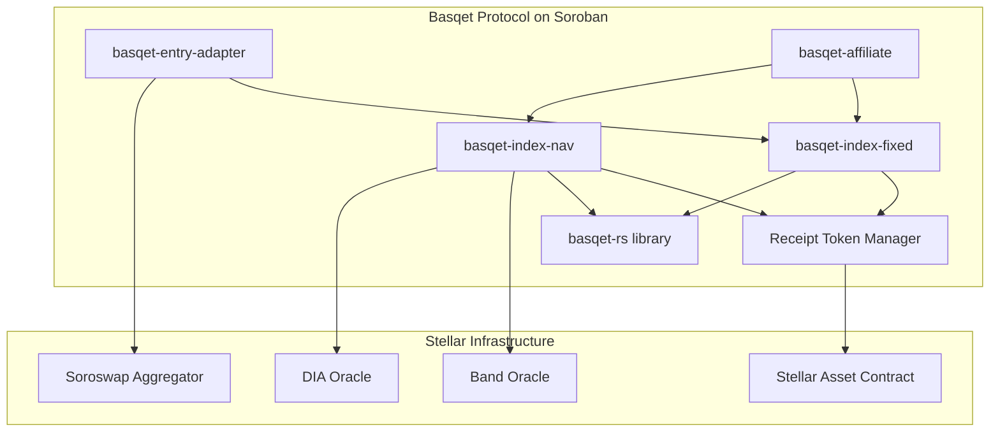

# Technical Architecture: Basqet Index Fund on Stellar Soroban

## Executive Summary

Basqet brings sophisticated index fund management to Stellar through four interconnected smart contracts and a comprehensive utility library. Leveraging Soroban's 5000 TPS throughput, parallel execution, and enterprise-grade security, our architecture enables permissionless index funds with dynamic rebalancing, multi-tier fee structures, and seamless DeFi integration.

---

## 1. System Architecture Overview

### Core Components



### Contract Suite

**basqet-index-fixed**
- Fixed-ratio index funds with atomic multi-asset operations
- Strict allocation enforcement with automatic validation
- Threshold-based rebalancing triggers
- Receipt token minting/burning for share tracking

**basqet-index-nav**
- NAV-based dynamic indices with oracle-driven pricing
- Flexible single-asset deposits with automatic conversion
- Permissionless rebalancing with incentive mechanisms
- Real-time NAV calculation: `sum(balance × oracle_price)`

**basqet-entry-adapter**
- Unified entry point for single-asset deposits into fixed indices
- DEX aggregation for optimal swap routing
- Slippage protection and minimum return guarantees
- Two-leg operations: swap → deposit atomically

**basqet-affiliate**
- Fee distribution to whitelisted partners
- Tiered commission structures based on volume
- Transparent referral tracking
- Automated settlement mechanisms

**basqet-rs library**
- High-precision decimal arithmetic for financial calculations
- Share pool accounting with inflation protection
- Asset management abstractions
- Fee calculation engines (AUM, transaction, performance)

---

## 2. Smart Contract Implementation

### 2.1 Storage Architecture

Leveraging Soroban's three-tier storage model for optimal performance and cost:

```rust
#[contract]
pub struct BasqetIndexNav;

#[contractimpl]
impl BasqetIndexNav {
    pub fn initialize(
        env: Env,
        admin: Address,
        oracle_aggregator: Address,
        config: IndexConfig
    ) {
        // Instance storage: Contract configuration
        env.storage().instance().set(&symbol_short!("ADMIN"), &admin);
        env.storage().instance().set(&symbol_short!("ORACLE"), &oracle_aggregator);

        // Persistent storage: Critical vault data with extended TTL
        env.storage().persistent().set(&symbol_short!("CONFIG"), &config);
        env.storage().persistent().extend_ttl(&symbol_short!("CONFIG"), 5184000); // 60 days

        // Temporary storage: Pending operations
        env.storage().temporary().set(&symbol_short!("INIT"), &true);
    }
}
```

### 2.2 Vault Management

```rust
#[derive(Clone, Debug)]
#[contracttype]
pub struct IndexVault {
    pub id: u64,
    pub name: String,
    pub allocations: Vec<AssetAllocation>,
    pub total_shares: i128,
    pub receipt_token: Address,
    pub nav: i128,
    pub last_rebalance: u64,
    pub status: VaultStatus,
}

#[derive(Clone, Debug)]
#[contracttype]
pub struct AssetAllocation {
    pub asset: Address,
    pub target_weight: u32,  // Basis points (10000 = 100%)
    pub current_balance: i128,
    pub last_price: Price,
}
```

### 2.3 Authorization & Security

Utilizing Soroban's native authorization framework:

```rust
pub fn deposit(
    env: Env,
    vault_id: u64,
    depositor: Address,
    asset: Address,
    amount: i128
) -> i128 {
    // Native authorization check
    depositor.require_auth();

    // Verify deposit amount
    let token_client = token::Client::new(&env, &asset);
    token_client.transfer(&depositor, &env.current_contract_address(), &amount);

    // Calculate shares based on NAV
    let shares = calculate_shares(&env, vault_id, amount);

    // Mint receipt tokens
    mint_receipt_tokens(&env, vault_id, &depositor, shares);

    // Emit event for indexing
    env.events().publish(
        (symbol_short!("deposit"), vault_id),
        (depositor, asset, amount, shares)
    );

    shares
}
```

---

## 3. Oracle Integration Layer

### 3.1 Multi-Oracle Aggregation

```rust
pub struct OracleAggregator {
    band_oracle: Address,
    dia_oracle: Option<Address>,
}

impl OracleAggregator {
    pub fn get_price(env: &Env, asset: &Address) -> Result<Price, OracleError> {
        // Primary: Band Protocol (production-ready on mainnet)
        let band_client = BandOracleClient::new(env, &self.band_oracle);

        match band_client.get_reference_data(&asset_symbol(asset), &"USD".into()) {
            Ok(price_data) if price_data.updated_at + 300 > env.ledger().timestamp() => {
                Ok(Price {
                    value: price_data.rate,
                    decimals: 18,
                    timestamp: price_data.updated_at,
                })
            },
            _ => {
                // Fallback to DIA Oracle if configured
                if let Some(dia) = &self.dia_oracle {
                    let dia_client = DiaOracleClient::new(env, dia);
                    dia_client.get_latest_price(asset)
                } else {
                    Err(OracleError::PriceUnavailable)
                }
            }
        }
    }
}
```

### 3.2 NAV Calculation Engine

```rust
pub fn calculate_nav(env: &Env, vault_id: u64) -> i128 {
    let vault = get_vault(env, vault_id);
    let oracle = get_oracle_aggregator(env);

    let mut total_value = 0i128;

    for allocation in vault.allocations.iter() {
        let price = oracle.get_price(env, &allocation.asset)
            .expect("Price feed unavailable");

        // Value = balance × price (with decimal adjustment)
        let asset_value = (allocation.current_balance * price.value)
            / 10i128.pow(price.decimals);

        total_value += asset_value;
    }

    // Update vault NAV
    update_vault_nav(env, vault_id, total_value);

    total_value
}
```

---

## 4. DEX Integration & Liquidity Aggregation

### 4.1 Soroswap Aggregator Integration

```rust
pub struct DexRouter {
    soroswap_aggregator: Address,
}

impl DexRouter {
    pub fn execute_rebalancing_swap(
        env: &Env,
        from_asset: Address,
        to_asset: Address,
        amount: i128,
        min_return: i128
    ) -> Result<i128, DexError> {
        let client = SoroswapAggregatorClient::new(env, &self.soroswap_aggregator);

        // Get optimal routing across Soroswap, Phoenix, and Aqua DEXs
        let distribution = client.get_protocols_distribution(
            &from_asset,
            &to_asset,
            &amount
        );

        // Execute swap with 5-minute deadline
        let deadline = env.ledger().timestamp() + 300;

        let amounts = client.swap_exact_tokens_for_tokens(
            &amount,
            &min_return,
            &distribution,
            &vec![from_asset, to_asset],
            &env.current_contract_address(),
            &deadline
        )?;

        Ok(amounts[1])
    }
}
```

### 4.2 Entry Adapter Pattern

```rust
impl BasqetEntryAdapter {
    pub fn deposit_single_asset(
        env: Env,
        index_address: Address,
        vault_id: u64,
        depositor: Address,
        input_asset: Address,
        amount: i128
    ) -> i128 {
        depositor.require_auth();

        // Get target allocation from index
        let index_client = BasqetIndexFixedClient::new(&env, &index_address);
        let required_assets = index_client.get_deposit_requirements(&vault_id, &amount);

        // Execute swaps to match allocation
        let router = get_dex_router(&env);
        let mut deposit_amounts = Vec::new();

        for requirement in required_assets.iter() {
            if requirement.asset == input_asset {
                deposit_amounts.push_back(requirement.amount);
            } else {
                let swapped = router.execute_swap(
                    &env,
                    input_asset.clone(),
                    requirement.asset.clone(),
                    requirement.amount,
                    requirement.min_amount
                )?;
                deposit_amounts.push_back(swapped);
            }
        }

        // Deposit into index
        index_client.deposit(&vault_id, &depositor, &deposit_amounts)
    }
}
```

---

## 5. Receipt Token System

### 5.1 SEP-41 Compliant Token Implementation

```rust
pub struct ReceiptTokenManager;

impl ReceiptTokenManager {
    pub fn deploy_receipt_token(
        env: &Env,
        vault_id: u64,
        index_name: &String
    ) -> Address {
        // Deploy SEP-41 compliant token contract
        let token_wasm_hash = env.storage()
            .instance()
            .get(&symbol_short!("TOKEN_WASM"))
            .expect("Token WASM not uploaded");

        let token = env.deployer().deploy_wasm(
            token_wasm_hash,
            (
                &env.current_contract_address(),  // Admin with mint/burn rights
                &7u32,                            // Decimals
                &format!("BASQET-{}", vault_id), // Name
                &format!("BQT-{}", vault_id),    // Symbol
            )
        );

        // Store token address
        env.storage().persistent().set(
            &(symbol_short!("RCPT_TOKEN"), vault_id),
            &token
        );

        // Extend TTL for critical data
        env.storage().persistent().extend_ttl(
            &(symbol_short!("RCPT_TOKEN"), vault_id),
            5184000  // 60 days
        );

        token
    }

    pub fn mint_shares(
        env: &Env,
        vault_id: u64,
        recipient: &Address,
        amount: i128
    ) {
        let token_address = get_receipt_token(env, vault_id);
        let token_client = token::Client::new(env, &token_address);

        // Mint new shares (requires admin auth)
        token_client.mint(&recipient, &amount);
    }
}
```

---

## 6. Fee Management System

### 6.1 Multi-Tier Fee Structure

```rust
#[derive(Clone, Debug)]
#[contracttype]
pub struct FeeConfiguration {
    pub aum_fee_bps: u32,         // Annual management fee (e.g., 100 = 1%)
    pub transaction_fee_bps: u32,  // Entry/exit fee (e.g., 30 = 0.3%)
    pub performance_fee_bps: u32,  // Performance fee (e.g., 1000 = 10%)
    pub fee_recipient: Address,
    pub affiliate_rate_bps: u32,   // Affiliate share of fees
}

impl FeeManager {
    pub fn calculate_fees(
        env: &Env,
        operation: FeeOperation,
        amount: i128,
        config: &FeeConfiguration
    ) -> FeeBreakdown {
        match operation {
            FeeOperation::Deposit => {
                let fee = (amount * config.transaction_fee_bps as i128) / 10000;
                let affiliate_fee = (fee * config.affiliate_rate_bps as i128) / 10000;

                FeeBreakdown {
                    protocol_fee: fee - affiliate_fee,
                    affiliate_fee,
                    net_amount: amount - fee,
                }
            },
            FeeOperation::AUM => {
                // Calculated daily from annual rate
                let daily_rate = config.aum_fee_bps / 365;
                let fee = (amount * daily_rate as i128) / 10000;

                FeeBreakdown {
                    protocol_fee: fee,
                    affiliate_fee: 0,
                    net_amount: amount - fee,
                }
            },
            _ => FeeBreakdown::default(),
        }
    }
}
```

### 6.2 Affiliate Distribution

```rust
impl BasqetAffiliate {
    pub fn distribute_fees(
        env: Env,
        vault_id: u64,
        collected_fees: i128
    ) {
        // Get registered affiliates for vault
        let affiliates = get_vault_affiliates(&env, vault_id);

        for affiliate in affiliates.iter() {
            let share = (collected_fees * affiliate.rate_bps as i128) / 10000;

            if share > 0 {
                // Transfer fee share to affiliate
                let token_client = token::Client::new(&env, &get_fee_token(&env));
                token_client.transfer(
                    &env.current_contract_address(),
                    &affiliate.address,
                    &share
                );

                // Emit distribution event
                env.events().publish(
                    (symbol_short!("fee_dist"), vault_id),
                    (affiliate.address, share, env.ledger().timestamp())
                );
            }
        }
    }
}
```

---

## 7. Rebalancing Mechanisms

### 7.1 Permissionless Rebalancing

```rust
impl BasqetIndexNav {
    pub fn run_rebalance(env: Env, vault_id: u64, executor: Address) -> Result<(), Error> {
        // No authorization required - permissionless operation

        // Check rebalance conditions
        let vault = get_vault(&env, vault_id);
        let oracle = get_oracle_aggregator(&env);

        // Calculate current vs target allocations
        let current_weights = calculate_current_weights(&env, &vault, &oracle)?;
        let target_weights = vault.allocations.iter()
            .map(|a| a.target_weight)
            .collect();

        // Check if rebalance threshold exceeded
        if !exceeds_threshold(&current_weights, &target_weights, REBALANCE_THRESHOLD) {
            return Err(Error::ThresholdNotMet);
        }

        // Execute rebalancing swaps
        let router = get_dex_router(&env);
        let swaps = calculate_rebalancing_swaps(&env, &vault, &current_weights, &target_weights);

        for swap in swaps.iter() {
            router.execute_rebalancing_swap(
                &env,
                swap.from_asset.clone(),
                swap.to_asset.clone(),
                swap.amount,
                swap.min_return
            )?;
        }

        // Update last rebalance timestamp
        update_vault_rebalance_time(&env, vault_id, env.ledger().timestamp());

        // Reward executor with rebalance incentive
        distribute_rebalance_reward(&env, &executor, vault_id);

        Ok(())
    }
}
```

### 7.2 Event-Driven Architecture

Replacing CosmWasm callbacks with Soroban's event system:

```rust
pub fn initiate_complex_rebalance(env: &Env, vault_id: u64) -> Result<(), Error> {
    // Store pending operation
    let operation = PendingRebalance {
        vault_id,
        steps: calculate_rebalance_steps(env, vault_id)?,
        current_step: 0,
        initiated_at: env.ledger().timestamp(),
    };

    env.storage().temporary().set(
        &(symbol_short!("PENDING_REB"), vault_id),
        &operation
    );

    // Emit initiation event
    env.events().publish(
        (symbol_short!("rebalance"), symbol_short!("start")),
        (vault_id, operation.steps.len())
    );

    Ok(())
}

pub fn continue_rebalance(env: &Env, vault_id: u64) -> Result<(), Error> {
    let mut operation: PendingRebalance = env.storage()
        .temporary()
        .get(&(symbol_short!("PENDING_REB"), vault_id))
        .ok_or(Error::NoActiveRebalance)?;

    // Execute next step
    execute_rebalance_step(env, &operation.steps[operation.current_step])?;
    operation.current_step += 1;

    if operation.current_step >= operation.steps.len() {
        // Complete rebalance
        env.storage().temporary().remove(&(symbol_short!("PENDING_REB"), vault_id));

        env.events().publish(
            (symbol_short!("rebalance"), symbol_short!("complete")),
            vault_id
        );
    } else {
        // Update pending operation
        env.storage().temporary().set(
            &(symbol_short!("PENDING_REB"), vault_id),
            &operation
        );
    }

    Ok(())
}
```

---

## 8. Performance & Optimization

### 8.1 Leveraging Soroban's Capabilities

**Parallel Execution**
- All contract operations declare footprints for parallel processing
- Non-conflicting transactions execute simultaneously
- 5000 TPS theoretical throughput with Protocol 23

**Storage Optimization**
```rust
// Efficient batch operations
pub fn batch_update_prices(env: &Env, updates: Vec<PriceUpdate>) {
    // Single storage write for multiple updates
    let mut price_map = env.storage()
        .persistent()
        .get::<_, Map<Address, Price>>(&symbol_short!("PRICES"))
        .unwrap_or_else(|| Map::new(&env));

    for update in updates.iter() {
        price_map.set(update.asset.clone(), update.price);
    }

    env.storage().persistent().set(&symbol_short!("PRICES"), &price_map);

    // Batch TTL extension
    env.storage().persistent().extend_ttl(&symbol_short!("PRICES"), 1296000); // 15 days
}
```

**Gas Efficiency**
- Fine-grained resource metering for predictable costs
- Optimized contract size through modular design
- Cached WebAssembly modules reduce execution overhead

### 8.2 Security Features

**Built-in Protection**
- Native replay protection via nonces
- Account abstraction for custom auth logic
- BLS12-381 support for advanced cryptography
- Formal verification through Rust toolchain

**Testing Infrastructure**
- Unit tests with Soroban test environment
- Fork testing against mainnet state
- Fuzz testing for edge cases
- Integration tests across contract suite

---

## 9. Integration Points

### 9.1 Frontend Integration

```rust
// Client SDK example
pub struct BasqetClient {
    index_nav: Address,
    index_fixed: Address,
    entry_adapter: Address,
}

impl BasqetClient {
    pub fn get_vault_info(&self, env: &Env, vault_id: u64) -> VaultInfo {
        let nav_client = BasqetIndexNavClient::new(env, &self.index_nav);

        VaultInfo {
            nav: nav_client.calculate_nav(&vault_id),
            total_shares: nav_client.get_total_shares(&vault_id),
            allocations: nav_client.get_allocations(&vault_id),
            last_rebalance: nav_client.get_last_rebalance(&vault_id),
        }
    }

    pub fn simulate_deposit(
        &self,
        env: &Env,
        vault_id: u64,
        amount: i128
    ) -> DepositSimulation {
        let nav_client = BasqetIndexNavClient::new(env, &self.index_nav);

        let current_nav = nav_client.calculate_nav(&vault_id);
        let total_shares = nav_client.get_total_shares(&vault_id);

        let shares_to_mint = if total_shares == 0 {
            amount  // First deposit
        } else {
            (amount * total_shares) / current_nav
        };

        DepositSimulation {
            shares_to_receive: shares_to_mint,
            nav_per_share: current_nav / total_shares,
            fees: calculate_deposit_fees(env, amount),
        }
    }
}
```

### 9.2 Monitoring & Events

```rust
// Event definitions for indexing and monitoring
pub enum BasqetEvent {
    Deposit {
        vault_id: u64,
        depositor: Address,
        amount: i128,
        shares: i128,
    },
    Withdrawal {
        vault_id: u64,
        withdrawer: Address,
        shares: i128,
        amount: i128,
    },
    Rebalance {
        vault_id: u64,
        executor: Address,
        swaps_executed: u32,
    },
    NavUpdate {
        vault_id: u64,
        nav: i128,
        nav_per_share: i128,
    },
    FeeCollection {
        vault_id: u64,
        fee_type: FeeType,
        amount: i128,
    },
}
```

---

## 10. Conclusion

The Basqet protocol on Stellar Soroban delivers a production-ready index fund infrastructure with:

- **High Performance**: 5000 TPS capability with parallel execution
- **Robust Oracle Integration**: Band Protocol and DIA for reliable price feeds
- **Efficient DEX Aggregation**: Soroswap integration for optimal liquidity
- **Flexible Fee Structure**: Multi-tier fees with affiliate distribution
- **Permissionless Operations**: Public rebalancing with incentive mechanisms
- **Enterprise Security**: Native auth, formal verification, comprehensive testing

Our architecture leverages Stellar's unique strengths while maintaining the sophisticated financial operations required for professional index fund management. The system is designed for immediate deployment with clear integration points for existing Stellar infrastructure.
